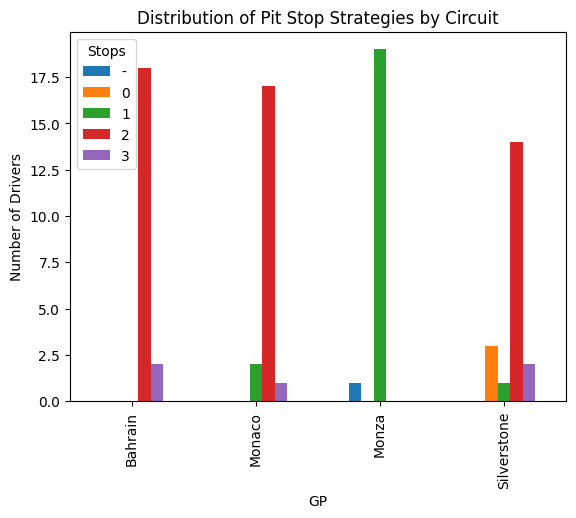
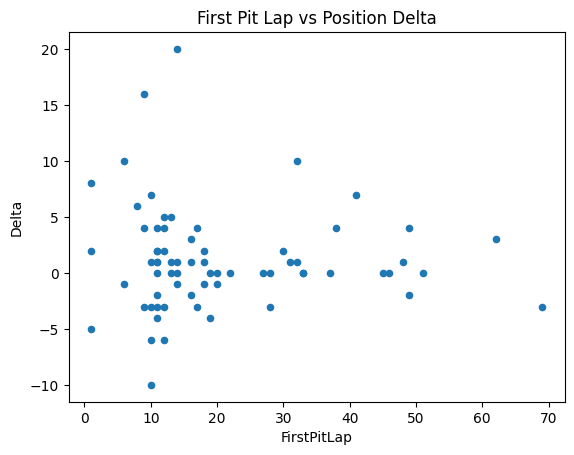

# F1 Pit Stop Strategy Analysis 🏎️

> *Dai Big Data alla Strategia di Gara: l'uso dell'Intelligenza Artificiale in Formula 1*

Analisi statistica dell'impatto delle strategie ai pit stop sui risultati di gara, in funzione delle caratteristiche dei circuiti — stagione F1 2025.

---

## 🎯 Domanda di Ricerca

**L'impatto della strategia ai pit stop sul delta di posizione varia in base alle caratteristiche del circuito?**

---

## 🏁 Circuiti Analizzati

| Circuito | Caratteristica chiave |
|---|---|
| Bahrain | Alta usura gomme, strategia decisiva |
| Monza | Alta velocità, basso carico, pochi pit stop |
| Silverstone | Circuito bilanciato, riferimento |
| Monaco | Caso estremo: sorpassi quasi impossibili |

---

## 📊 Metodologia

- **Variabile dipendente**: Position Delta (posizioni guadagnate/perse)
- **Variabili indipendenti**: numero di pit stop, timing del primo pit, tipo di circuito
- **Campione**: 20 piloti × 4 gare (stagione 2025)
- **Edge case gestiti**: DNF, penalità, DNS, partenze dalla pit lane, squalifiche

---

## 🔍 Ipotesi

1. La strategia ha **maggiore impatto** sui circuiti ad alta usura (Bahrain)
2. A Monaco la strategia ha **impatto minimo** per via delle poche opportunità di sorpasso
3. Il timing ottimale del primo pit varia significativamente per circuito

---

## 📈 Risultati Preliminari

> ⚠️ Risultati basati su un dataset limitato, soggetti a revisione.

### Strategie ai pit stop

- Le **strategie a 2 stop** dominano e mostrano un guadagno mediano di ~+1 posizione
- Le **strategie a 1 stop** sono sostanzialmente neutre
- Le **strategie a 3 stop** mostrano alta variabilità (campione troppo piccolo per conclusioni)

### Timing del primo pit stop

- Nessuna relazione lineare forte tra lap del primo pit e delta finale
- I pit stop precoci mostrano alta variabilità (spesso decisioni reattive)
- I pit stop a metà gara tendono a essere neutri

### Dipendenza dal circuito
- La stessa strategia produce risultati molto diversi a seconda del tracciato
- **Conclusione provvisoria**: la strategia da sola non spiega la performance — il contesto di gara è determinante

---

## 🛠️ Stack Tecnologico

`Python` · `pandas` · `matplotlib` · `statsmodels` · `scipy`

---

## 🗺️ Roadmap

- [x] Raccolta dati (4 circuiti)
- [x] Gestione edge case
- [x] Analisi descrittiva e visualizzazioni iniziali
- [ ] Analisi di correlazione (timing pit stop ↔ delta)
- [ ] Modello di regressione per quantificare l'impatto per circuito
- [ ] Visualizzazioni comparative avanzate
- [ ] Conclusioni finali

---

## 📬 Contatti

**Filippo Castagnola** — fi.castagnola@gmail.com

Suggerimenti, correzioni sui dati o idee per analisi aggiuntive sono sempre benvenuti — apri pure una issue!

---

*Questo progetto è il cuore della mia tesi triennale in Informatica — Università degli Studi di Perugia.*
