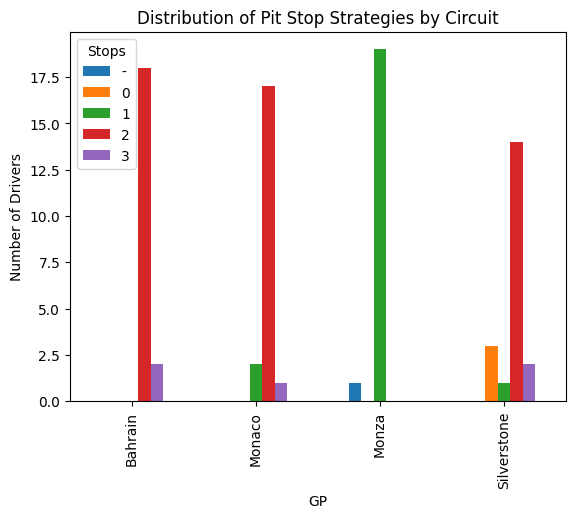
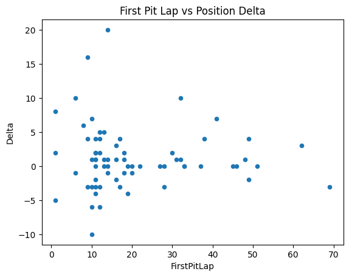

# F1 Pit Stop Strategy Analysis 🏎️

> *From Big Data to Race Strategy: Using AI in Formula 1*

Analyzing how pit stop strategy impacts race results across different circuit types in the 2025 F1 season.

## 🎯 Research Question

**Does the impact of pit stop strategy on race position vary by circuit characteristics?**

## 🏁 Circuits Analyzed

- **Bahrain** - High tire degradation, strategy-critical
- **Monza** - Low downforce, high speed, minimal stops
- **Silverstone** - Balanced benchmark circuit
- **Monaco** - Outlier case, overtaking nearly impossible

## 📊 Methodology

- **Dependent Variable**: Position Delta (positions gained/lost from start to finish)
- **Independent Variables**: Number of pit stops, timing of first stop, circuit type
- **Sample**: All 20 drivers across 4 races (2025 season)
- **Edge Cases Handled**: DNFs, penalties, pit lane starts, disqualifications

## 🔍 Key Hypotheses

1. Pit stop strategy has **greater impact** on position delta at high-degradation circuits (Bahrain)
2. At Monaco, pit strategy has **minimal impact** due to low overtaking opportunities
3. Optimal first pit stop timing varies significantly by circuit type

---

## 📊 Visual Analysis

### Pit Stop Strategy Distribution Across Circuits

### First Pit Stop Timing vs Position Change

## 🔍 Preliminary Findings

> ⚠️ These are early results based on a limited dataset and may evolve.

- **2-stop strategies dominate** and show a slight positive median position gain (~+1).
- **1-stop strategies are mostly neutral**, with little impact on position changes.
- **3-stop strategies show higher gains**, but the sample size is very small and results are highly variable.

### 🏁 Circuit dependency
- Strategy effectiveness varies significantly across races.
- The same number of pit stops can lead to different outcomes depending on the circuit.

### ⏱️ Pit stop timing
- No strong linear relationship between first pit stop timing and position delta.
- Early stops show high variability (often reactive decisions).
- Mid-race stops tend to produce neutral outcomes.
- Late stops can lead to gains, but inconsistently.

➡️ **Conclusion:** Pit stop strategy alone does not fully explain race performance — race context plays a key role.

---

## 🛠️ Tech Stack

`Python` `pandas` `matplotlib` `statsmodels` `scipy`

## 📂 Project Status

🚧 **Work in Progress** - Data collection complete, statistical analysis ongoing

- [x] Data collection for 4 circuits
- [x] Edge case documentation
- [ ] Statistical correlation analysis
- [ ] Circuit-type comparative visualizations
- [ ] Regression modeling
- [ ] Final conclusions

## 🚀 Next Steps

1. Complete correlation analysis between pit timing and position delta
2. Build regression model to quantify strategy impact by circuit
3. Visualize strategy effectiveness across track types
4. Write findings summary

---

*This project will **hopefully** form part of my thesis: "Dai big data alla strategia di gara: l'uso dell'intelligenza artificiale in Formula 1"*

## 📬 Contributing

This project strives to being a thesis project, but suggestions and feedback are welcome! Feel free to:
- Open an issue for data corrections
- Suggest additional analyses
- Share relevant F1 strategy insights

Contact: fi.castagnola@gmail.com
